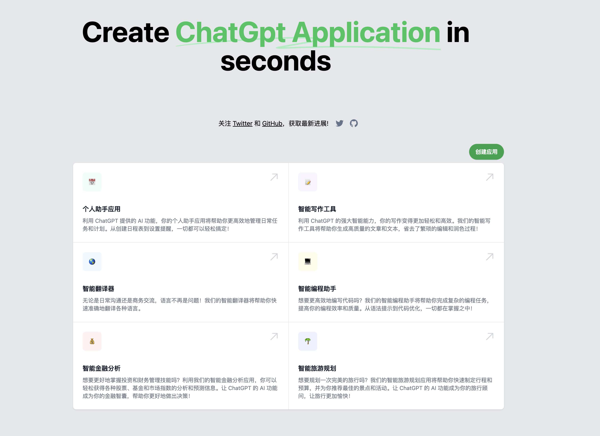

# OpenGpt

网址：https://open-gpt.app/

最近看到了非常多基于 #OpenAI 的项目。我们每个人都应该具有创建这些项目的能力，从而解决自己的问题。
我准备创建一个 AI 平台，让所有用户都可以使用并创建 #ChatGPT 小应用。开源！
会在 [Twitter](https://twitter.com/EclipsePrayer) 上实时推送进展，欢迎点赞关注!

## 计划的功能

- [x] 用户可以直接运行每一个 App
  - ✅ 2023-03-04 上线第一个 App “Free Style 说唱歌词生成器”
  - ✅ 2023-03-05 上线共 6 款 App，砖已足够，需要引玉
- [x] 用户可以创建自己的 App
  - ✅ 2023-03-08 用户可以创建自己的 App，第一阶段计划完成
  - ✅ 2023-03-08 上线第一天，用户已经创建了 100 多个 App！🤯
  - ✅ 2023-03-11 用户创建的 App 数量超过 800！🤯🤯🤯
- [x] 支持用户使用自己的 API token，从而放开 rate limit 限制
- [x] 整理一些明显不好用的 App，在首页隐藏不显示

下一阶段计划

- [ ] 加入用户登录功能
- [ ] 可以点赞，并可以据此排序
- [ ] 可以收藏，创建属于自己的 App 应用列表
- [ ] 让创作者能够利用平台盈利！
- [ ] 为 App 添加标签
- [ ] 可以创建只属于自己的私有 App
- [ ] i18n 国际化支持

## 共同建设

加入 [Discord](https://discord.gg/84J7aMyyCG)，我们一起讨论产品未来
